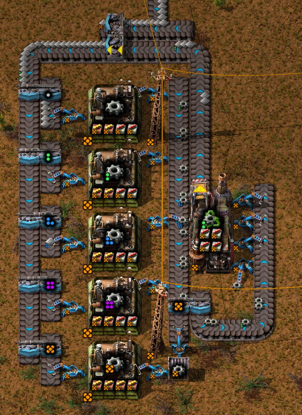

# Factorio Quality Optimizer

This is a tool to optimize the quality of items in Factorio. It tries to find the optimal balance between the number of productivity and quality modules, to maximize the output of best quality items.

## Basic setup



For each quality tier, you need at least an assembly machine with at least one quality module, except for the highest tier assembly machine, which can be filled with productivity modules. The input for the assembly machines is the output of the previous tier.
Any output that is not the desired quality is recycled, with a recycler filled with quality modules.

The goal is to optimize the number of maximum quality output, given a fixed number of input items.

Note that more machines can be added to the setup, and input does not have to be of the lowest quality.

## Formula

Let's define the following variables:

 - $p_i$ The productivity of the $i$ th tier assembly machine (with all modules) (5th tier = Legendary, 4th tier = Epic, etc...)
 - $q_i$ The quality bonus of the $i$ th tier assembly machine (summing over all modules)
 - $q_r$ The quality bonus of the recycler
 - $k$ The maximum number of modules for the assembly machines
 - $h_i$ The number of top quality items produced from a set of $i$ th tier quality items needed for the $i$ th tier assembly machine to produce one output item.
 - $p$ The best available productivity bonus (for one module)
 - $q$ The best available quality bonus (for one module)


Note that $q_r = q * 4$, since the recycler has 4 module slots.

We want to maximize $h_i$. We can express them as follows:

$$
h_5 = p_5
$$

Indeed, there is no need to use quality modules, so assuming base productivity of 1, 

$$
h_5 = 1 + k \times p
$$

Then, 

$$
h_4 = h_4 p_4(1 - q_4)\frac{1 - q_r}{4} + h_5 p_4(1 - q_4)\frac{q_r}{4} + p_4q_4
$$

The first term of the sum is if the assembly machine created a Q4 quality item, which was then recycled into Q4 quality input. 
The second term is if the assembly machine created a Q4 quality item, which was then recycled into Q5 quality input. 
The last term is if the assembly machine created a Q5 quality item.

This can be rewritten as:

$$
h_4 = (h_5q_r(1 - q_4) + 4q_4) / (\frac{4}{p_4} - (1 - q_4)(1 - q_r)) 
$$

This is also the form that is used in the code.

Similarly, we have:

$$
h_3 = \frac{p_3}{4} \left( h_3 (1 - q_3)(1 - q_r) + h_4 (0.9q_r(1-q_3) + 0.9q_3(1-q_r)) + h_5 (0.1q_r(1-q_3) + 0.9q_rq_3) + 0.1p_3q_3 \right)
$$

The first term of the sum is if the assembly machine created a Q3 quality item, which was then recycled into Q3 quality input. 
The second term is if the assembly machine either 

 - created a Q3 quality item, which was then recycled into Q4 quality input,
 - created a Q4 quality item, which was then recycled into Q4 quality input.

The third term is if the assembly machine either

 - created a Q3 quality item, which was then recycled into Q5 quality input,
 - created a Q4 quality item, which was then recycled into Q5 quality input.

The last term is if the assembly machine created a Q5 quality item.

This can be rewritten as:

$$
h_3 = \left( h_4 (0.9q_r(1-q_3) + 0.9q_3(1-q_r)) + h_5 (0.1q_r(1-q_3) + 0.9q_rq_3) + 0.1p_3q_3 \right) / \left( \frac{4}{p_3} - (1 - q_3)(1 - q_r) \right) 
$$

And so on.

## Usage

```python
	main(k, base_productivity, filename_suffix)
```

Where:

 - `k` is the maximum number of modules for the assembly machines
 - `base_productivity` is the base productivity bonus of the machine

The function will create a csv file. In each cell, the data will given in the form:

```bash
[P:2 Q:2] | E_out:0.012519004224558400708
[P:2 Q:2] | E_out:0.041607965691481048953
[P:2 Q:2] | E_out:0.13840359403868127637
[P:2 Q:2] | E_out:0.46341411587212205564
[P:4 Q:0] | E_out:2.00
```

First line is for the first machine, second line for the second machine, etc... The numbers after P and Q are the number of modules of each kind.

The T0P0 line of productivity is for recipes that cannot accept productivity modules.

If Epic and Legendary qualities are not available, use Q5 for the highest quality tier (Rare), and Q3 for common. If Epic is available, but not legendary, use Q5 for Epic and Q2 for common.

